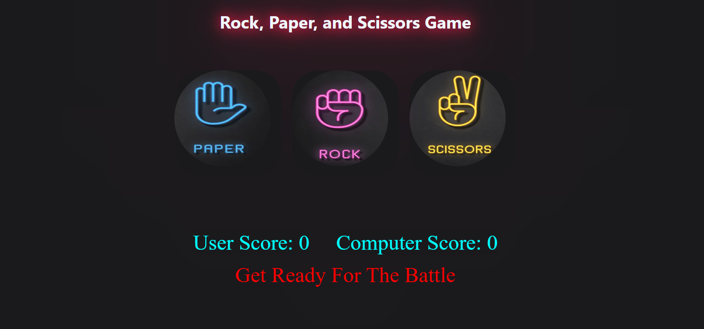

# Rock-paper-game



## Description
This is a web-based implementation of the classic Rock-Paper-Scissors game. It allows users to play the game against the computer, with a simple and intuitive interface.

## Technologies Used
- **HTML**: For the structure of the web pages.
- **CSS**: For styling the application.
- **JavaScript**: For game logic and interactivity.

## Features
- Play Rock-Paper-Scissors against the computer.
- Simple and clean user interface.
- Responsive design for mobile and desktop.

## How to Run
1. Clone the repository:
    ```bash
    git clone https://github.com/sudhirskp/Rock-paper-game.git
    ```
2. Navigate to the project directory:
    ```bash
    cd Rock-paper-game
    ```
3. Open `index.html` in your web browser.

## Future Enhancements
- Add multiplayer support.
- Implement additional game modes.
- Improve animations and UI design.

## Contributing
Contributions are welcome! Please fork the repository and make your changes in a separate branch. Submit a pull request for review.

## License
This project is licensed under the MIT License. See the [LICENSE](LICENSE) file for more details.
